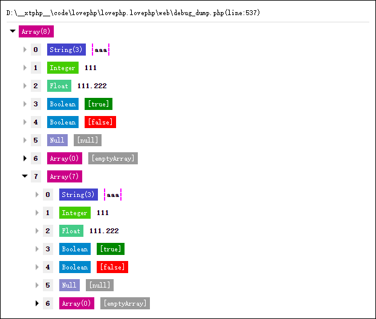

# debug_dump-PHP标量美化输出

# 介绍
`lovephp`全栈框架的一个副产品,只有一个php文件,一个php函数,用来替换print_r和var_dump美化输出php标量,方便php开发者进行调试,同时提供的less和js文件仅供参考,需要放在`lovephp`框架内才能正常编译

# 运行效果

# 版权声明
> LOVEPHP的版权归`lovephp.com`所有  
> 采用MIT开源协议:<a href="http://opensource.org/licenses/MIT" target=_blank>http://opensource.org/licenses/MIT</a>